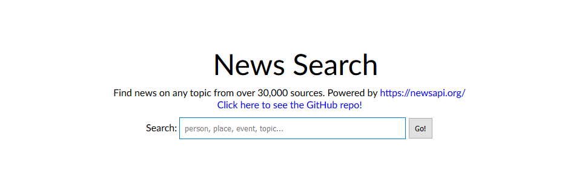

# News Aggregator App

Staying informed is important. And finding unbiased sources is close to impossible. So I figure the next best thing to impartiality is equality.

This news aggregator is simple: you provide a topic and the site returns the most relevant results from just about any source you can imagine!

I encourage you to open an issue if you encounter a bug or if you'd like to see a feature added.

## Usage
Live site available at http://news.mswanson.me/

* Type a topic of interest into the text field and hit Enter to **search** for related news
* Click on one of the articles to **open** that article in a new window

## Screenshots

Landing Page:

Results:

## Caveats

* Spelling counts! This search does not do fuzzy string matching, so watch for typos.

## Development Goals

* Add geolocation feature for approximated local news
* Add additional search parameters and filtering options

## Built With

HTML, CSS, JavaScript, jQuery